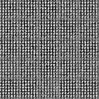
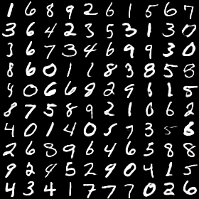

# BEGAN in CNTK 

Microsoft Cognitive Toolkit (CNTK) implementation of [BEGAN: Boundary Equilibrium Generative Adversarial Networks](http://arxiv.org/abs/1703.10717)

## Prerequisites
- Python 2.7 or Python 3.5+
- [CNTK==2.5.1+](https://github.com/Microsoft/CNTK#installation)

**Note**: I found that lower versions of CNTK caused abnormal training results of the GAN.

## Usage

First, download MNIST dataset:

    $ python install_mnist.py

Second, train the GAN:

    $ python train.py

Third, generate digits with the trained generator:

    $ python test.py --num_imgs=1000 --checkpointPath=models/BEGAN_G_274100.dnn

## Result on MNIST 
From scratch to 300k (frames captured every 1000 iter.)

`gamma=1.0`

Generated images with a trained model

